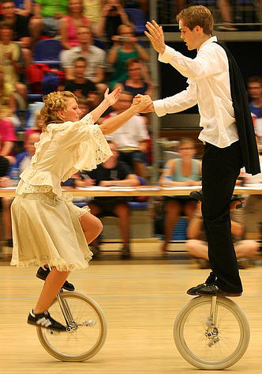
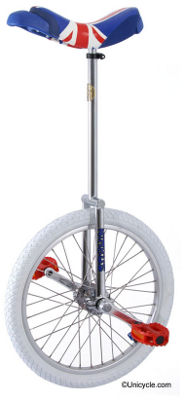

# About Freestyle Unicycling

Freestyle unicycling is type of unicycling that focuses on performing tricks
typically in a large flat open space. These tricks often involve riding or
mounting a unicycle in a challenging ways e.g. riding with only one foot on a
pedal (see a list of freestyle skills see [here](http://www.unicycle.org.uk/freestyle/skills_levels)
or the [unicyclopedia](http://en.wikibooks.org/wiki/The_Unicyclopedia/Freestyle)).
At unicycle conventions there are often freestyle
competitions in which an individual or individuals perform a routine
incorporating skills (and often fancy dress) on which they judged. An example
can be seen in figure 1 where two people are performing a paired freestyle
routine in fancy dress.

# Freestyle unicycles

Freestyle unicycles typically have a 20“ wheel with a thin smooth tyre and a
long neck. Freestyle unicycles often have plastic pedals (as opposed to metal
pedals) and a white tyre because they don't mark the floor which more often
than not is a hired hall. Freestyle
unicycles are also commonly used to play unicycle hockey.

