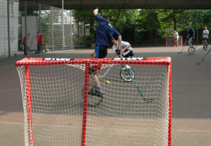

# About Hockey

**The UK Unicycle Hockey League has [a website](http://www.unicycle-hockey.co.uk)
where up to date information can be found about upcoming tournaments, results
and league tables.**

## Main rules

1. There are five players per team.
1. There are no specific rules relating to goalkeepers i.e. the goalie is treated the same as any other player.
1. The ball can only be played when a player is riding the unicycle i.e. not touching the ground.
1. Putting your stick under or through someone else's wheel is a foul.
1. A goal can only be scored from within your opponents half.
1. You can play the ball with your hand but you cannot score a goal like that.
1. Each half starts with the referee throwing the ball onto the centre spot between one player of each team.
1. After a goal the non-scoring team restarts by playing the ball over the half way line.

## Safety rules

1. The bottom of the stick must not be lifted above hip height.
1. One hand must always be placed at the top end of the stick. You can swap which hand is at the top and play either one or two handed but the stick should not be handled with the top end uncovered.
1. The stick must not be released or thrown intentionally.

**Please see [here](https://unicycling.org/files/iuf-rulebook-2013.pdf) for more details of the current rules**
