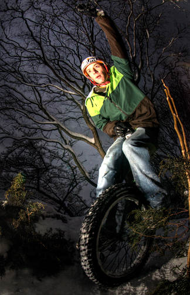
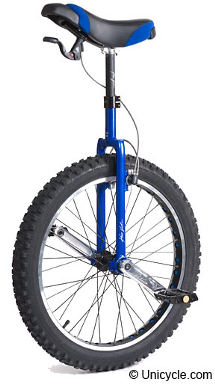

# About Muni

Mountain unicycling (often abbreviated to muni) is a type of unicycling
performed on various different terrains that are off road (examples include
muddy trails, snow & northshore). Muni often involves riding quickly on
unpredictable terrain so it is advisable to wear protection (e.g. helmet and
shin pads). Muni riders often ride off drops and ride thin beams.

## Mountain unicycle

A Municycle typically has a 24“ or 26” wheel with long (compared to freestyle unicycles) cranks and needs to be built to withstand a good deal of punishment and be capable of handling rough terrain. Consequently municycles often have the following characteristics:

* Wide rim & knobbly tyre
* Strong rim
* Multi-splined crank & hub design
* Metal pedals (in wet weather conditions plastic pedals are usually inadequate)
* Double bolted seat clamp (quick release seat clamps are usually inadequate)
* Long crank arms ~140mm (short crank arms create insufficient torque)
* A brake to control speed on downhill descents

## Videos

<iframe width="420" height="315" src="//www.youtube.com/embed/MtJZVHkhm-M" frameborder="0" allowfullscreen></iframe>

<iframe width="560" height="315" src="//www.youtube.com/embed/GUZuyMVdVcc" frameborder="0" allowfullscreen></iframe>
