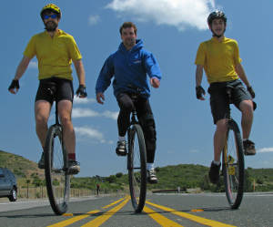
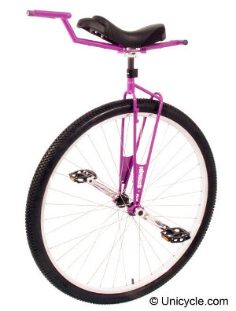

# About Road Unicycling

Road unicycling is a type of unicycling that generally happens on roads. Like
road bicycling, road unicycling can take place over varying distances. There
can be short sprint races, up to long distance endurance races and tours, where
riders will cover hundreds of kilometers. Many people use it as a form of
transport, in order to get to work, or go to the shops, but mainly people ride
for fun. Road unicycling is a fantastic way to see the world from a different
perspective, not only does it make you think about things differently, but
you're higher up!

## Road Unicycles

Unlike other types of unicycling the aim is to cover distance which means road
unicycles need to be designed a little differently. Most unicycles are “fixed
gear” which means 1 revolution on the cranks gives 1 revolution of the wheel
(as opposed to a geared bicycle where 1 rotation of the cranks can give
multiple rotations of the wheel) which means to travel a good distance the
radius of the wheel needs to be sufficient.  Most road unicycles have a wheel
(effective diameter) size between 29“-36” to allow their riders to travel a
reasonable distance. The handle allows the rider to hold on to something whilst
they lower themselves to become a little more streamlined. The handle is also
useful because you can attach extra stuff to it like a bag, lights, etc.

## Example Videos

<iframe width="560" height="315" src="//www.youtube.com/embed/K3N98OpqwB0" frameborder="0" allowfullscreen></iframe>
