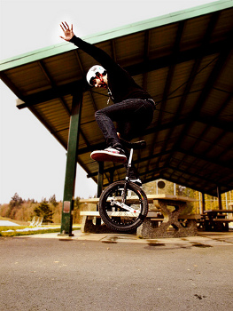
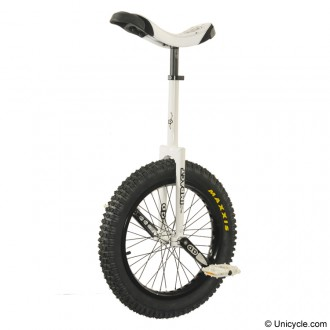

# About Street

Street unicycling is a type of unicycling that focuses on performing tricks on
a variety of urban obstacles (e.g. curbs, ledges, stairs and hand rails). More
information about street tricks can be found [here](http://en.wikibooks.org/wiki/The_Unicyclopedia/Street).

The [IUF has "Extreme levels"](https://unicycling.org/unicycling/skill-levels/extreme-levels/) which covers many
street unicycling skills.

## Street unicycles

A Street unicycle has a 19“ wheel and is very similar to a trials unicycle
except it tends to have shorter cranks and may have a longer neck. A Street
unicycle needs to be able to take a lot of punishment consequently they often
have the following characteristics:

* Wide rim & knobbly tyre
* Strong rim
* Multi-splined crank & hub design
* Metal pedals (in wet weather conditions plastic pedals are usually inadequate)
* Double bolted seat clamp (quick release seat clamps are usually inadequate)

## Example Videos

<iframe width="560" height="315" src="//www.youtube.com/embed/Q0l4sqO3azo" frameborder="0" allowfullscreen></iframe>

<iframe width="560" height="315" src="//www.youtube.com/embed/zwbP34vOvsw" frameborder="0" allowfullscreen></iframe>
