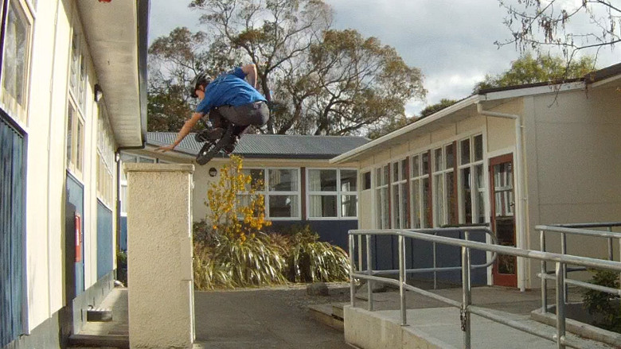
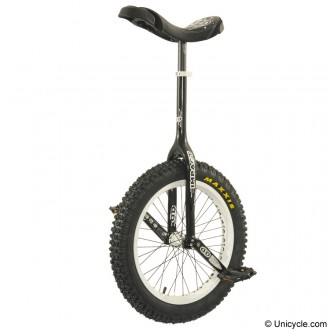

# About Trials

Trials unicycling is a type of unicycling that focuses on trying to overcome
various natural or urban obstacles without falling off or putting a foot or
hand down. The sport derives from bike trials although competitions are
performed differently. Unicycle trials competition lines allow for multiple
attempts without regard to the time taken to complete a line. Bike trial
competition lines only allow single attempts at a line regarding time. Because
the rider aims not to fall off or touch the obstacles balance is of great
importance in unicycle trials.
More information about trials techniques can be found [here](http://en.wikibooks.org/wiki/The_Unicyclopedia/Trials).

## Trials unicycles

A trials unicycle has a 19“ wheel and is very similar to a street unicycle
except it tends to have longer cranks and may have a shorter neck. A trials
unicycle needs to be able to take a lot of punishment consequently they often
have the following characteristics:

* Wide and grippy tyre
* Strong & wide rim for extra stability
* Multi-splined crank & hub design for extra strength when jumping
* Metal pedals in order to keep the pedals 'stuck' to your feet
* Bolted seat clamp, quick release seat clamps usually slip when pulling hard on the saddle

## Videos

<iframe width="560" height="315" src="//www.youtube.com/embed/1_jqUZE64To" frameborder="0" allowfullscreen></iframe>

<iframe width="560" height="315" src="//www.youtube.com/embed/GooNOBpCpJ8" frameborder="0" allowfullscreen></iframe>
